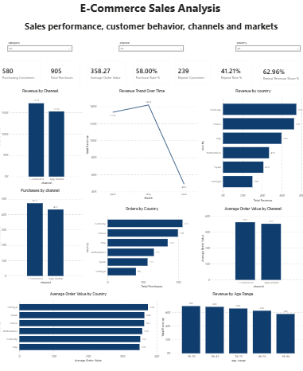

# E-Commerce Sales Analysis

E-commerce sales analysis using SQL and Power BI, focused on customer behavior, sales performance, market trends, and actionable business insights.

---
## Dashboard Preview



---

## Project Overview

This project analyzes e-commerce sales data to understand purchasing behavior, sales performance, purchasing channels, geographic markets, and revenue trends.

The analysis combines SQL-based data analysis with Power BI visualization to identify meaningful business patterns and translate them into actionable recommendations.

---

## Business Questions

The analysis focuses on the following business questions:

- How is revenue distributed across purchasing channels?
- Which countries generate the highest revenue and purchase volume?
- How does revenue change over time?
- Which customer age groups contribute the most revenue?
- What proportion of customers make repeat purchases?
- How much revenue is generated by repeat customers?
- Which markets have the highest average order value?
- Are product categories contributing equally to revenue?
- Where are the main opportunities for improving revenue performance?

---

## Key Findings

### Customer Retention

- 580 customers made purchases.
- 239 customers made repeat purchases.
- Repeat customers represent **41.21%** of purchasing customers.
- Repeat customers contribute **62.96% of total revenue**.

This indicates that repeat customers represent a smaller portion of the customer base but contribute a disproportionately large share of revenue, highlighting customer retention as an important business opportunity.

### Sales Performance

- E-commerce generated slightly higher revenue than App Mobile.
- Purchase volume was also slightly higher through E-commerce.
- Revenue increased from April to May before declining significantly in June.
- Revenue was distributed almost evenly across the five analyzed product categories.

### Geographic Performance

- Germany generated the highest revenue among the analyzed markets.
- Germany also recorded the highest purchase volume.
- France and Italy followed Germany in both revenue and purchase activity.
- Portugal recorded the highest average order value.
- Italy recorded the lowest average order value among the analyzed countries.

### Customer Segments

- Customers aged **26–35** generated the highest revenue among the analyzed age groups.
- Customers aged **56–65** generated the lowest revenue.

---

## Business Recommendations

### 1. Prioritize Customer Retention

Repeat customers generate a significantly larger share of revenue compared with their share of the customer base.

Recommended actions include:

- Loyalty programs
- Personalized offers
- Targeted retention campaigns
- Incentives for repeat purchases

### 2. Focus on High-Performing Markets

Germany is the strongest market based on both revenue and purchase volume.

The business should prioritize customer acquisition and retention efforts in Germany while investigating opportunities to improve performance in lower-volume markets.

### 3. Investigate the June Revenue Decline

Revenue declined significantly in June after increasing from April to May.

Potential drivers should be investigated, including:

- Lower customer activity
- Seasonality
- Campaign changes
- Marketing performance
- Data or reporting issues

### 4. Target High-Value Customer Segments

Customers aged 26–35 generated the highest revenue, while Portugal recorded the highest average order value.

Targeted campaigns can be tested across high-performing customer segments and markets to determine whether similar purchasing behavior can be replicated elsewhere.

---

## Tools & Technologies

- **SQL** — Data analysis, validation, and business metrics
- **Power BI** — Interactive dashboard and data visualization
- **DAX** — Calculated measures and KPIs
- **HTML & CSS** — Project report
- **Git & GitHub** — Version control and project documentation

---

## Project Workflow

```text
Data
  ↓
Data Preparation & Validation
  ↓
SQL Analysis
  ↓
Data Modeling & DAX
  ↓
Power BI Dashboard
  ↓
Business Insights
  ↓
Recommendations